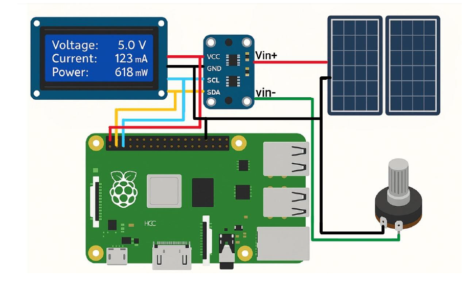
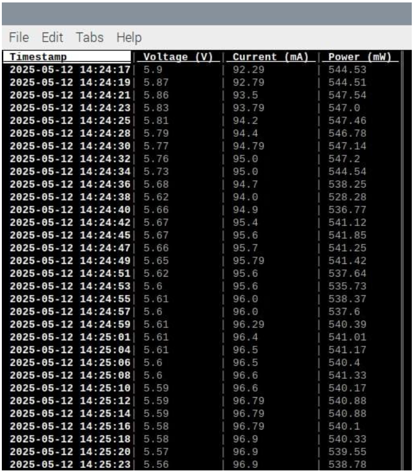
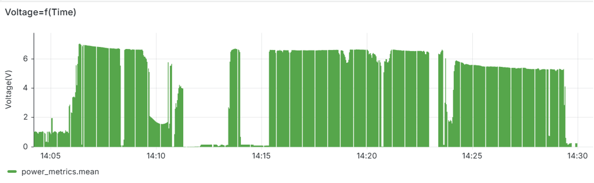
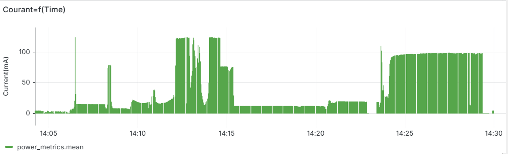
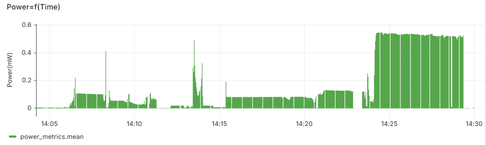
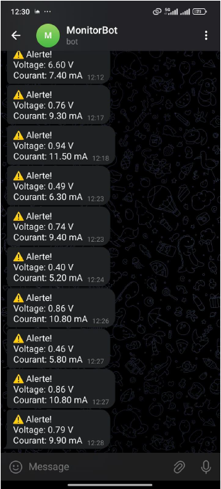

# Smart Energy Monitoring System

### Overview
Developed a real-time smart energy monitoring platform on Raspberry Pi to track voltage, current, and power consumption.  
The system integrates data storage, visualization, and live alerts for proactive energy management.

### Features
- Real-time acquisition of **voltage, current, and power**
- Grafana dashboards built on InfluxDB for interactive data visualization
- Automated CSV exports for record keeping
- Telegram Bot integration for real-time consumption alerts
- Dataset structuring prepared for future **AI-based load forecasting**

### Tech Stack
Raspberry Pi, Python, InfluxDB, Grafana, Telegram Bot, CSV automation

### Media
- 📸 System Schematic: 
- 📊 CSV Export Example: 
- 📉 Voltage Data: 
- 📉 Current Data: 
- 📉 Power Data: 
- 🤖 Telegram Bot Alerts: 
- 🎥 [Demo Video – Telegram Bot](https://youtu.be/xxxx)

### Contributions
- Implemented energy monitoring pipeline from sensor acquisition to database storage
- Designed Grafana dashboards for intuitive visualization
- Automated alerts via Telegram bot for real-time user feedback
- Structured datasets to support future predictive analytics
- Prepared the system for AI-based load forecasting by structuring datasets and processing environment.
